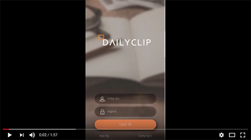
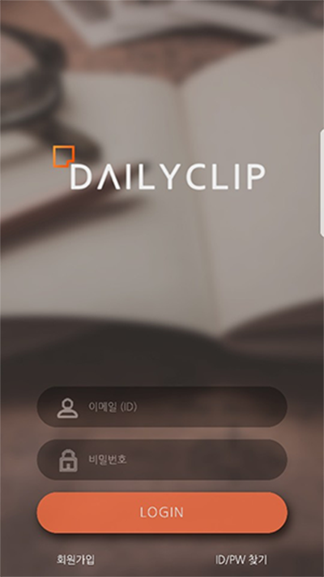
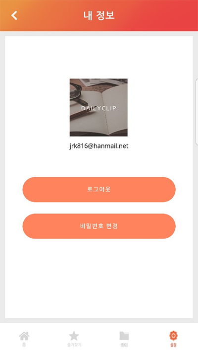
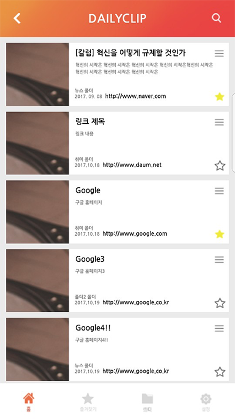
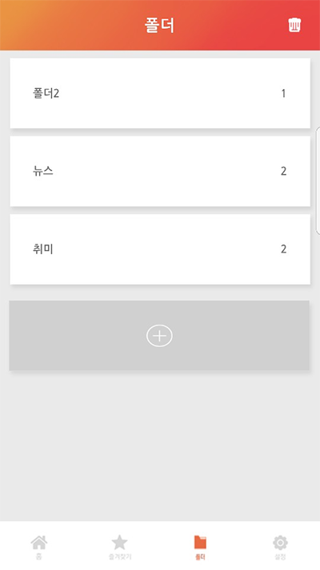
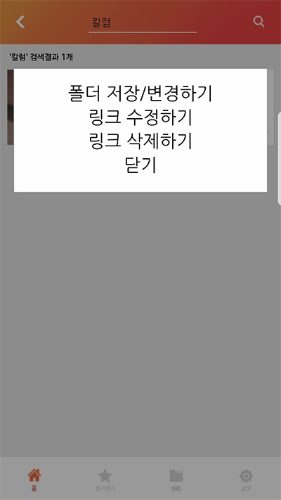
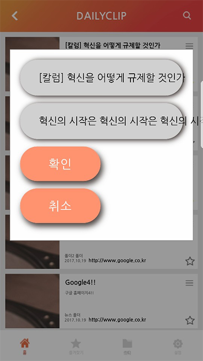
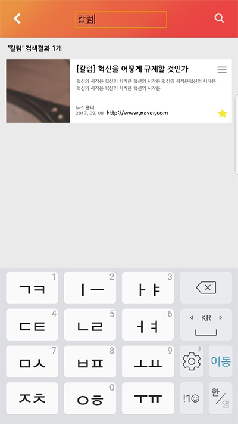
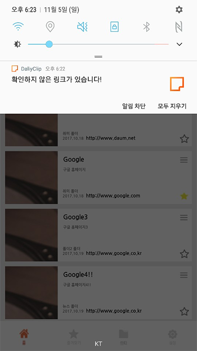

# DailyClip [CrossIT WebApp Project]

나중에 참고할 링크를 따로 저장했다가 잊어버린적이 있나요? 
나를 위한 링크를 폴더로 구분하고 즐겨찾기에 등록해주세요! 
나중에 보려고 했는데 잊어버렸다면, Push 기능이 준비되어 있습니다.  

## 0.Member
<b>기획</b> : 김민재 
<b>디자인</b> : 김화영 
<b>퍼블리셔</b> : 김강섭 
<b>개발</b> : 신윤희, 유태양, 이동건, 구동림  

  <a href="https://www.youtube.com/watch?v=PtY10AC9wBw&feature=youtu.be">
  
 </a> 
  <b>[Youtube Sample]</b> 
  https://dailyclip-b64d3.firebaseapp.com/ 
  [해당 페이지는 사라져 있을수도 있습니다.]

## 1 .메인페이지와 마이페이지
 

  
  
   

 

## 2 .링크 리스트와 폴더 리스트
 

  
  
   

 

## 3 .수정 메뉴와 링크 정보 수정
 

  
  
   

 

## 4 .검색 기능과 push 기능
 

  
  
   

 
